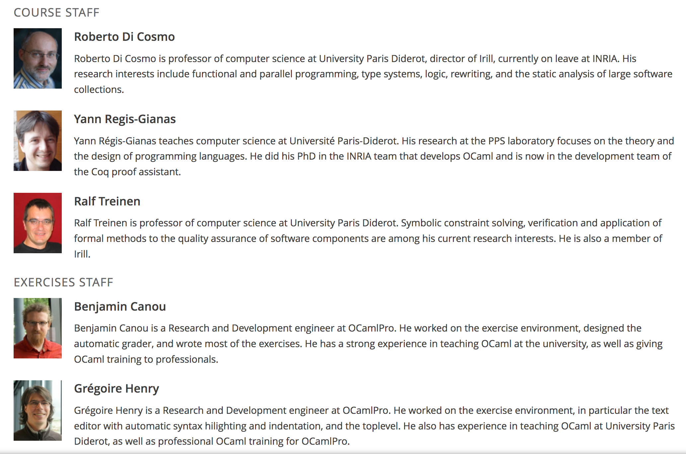

# Introduction to Functional Programming in OCaml

*Functional programming* is a programming paradigm which is rapidly attracting interest from a broad range of developers because it allows to write expressive, concise and elegant programs.

In this MOOC you will learn *Functional programming* using the *OCaml* programming language.You will discover the powerful mechanisms that are offered to build and manipulate complex data structures in a clean and efficient way. And you will see how functions play a central role, as first-class values that can be freely used in any place where an expression can appear.

The *OCaml* programming language is a member of the ML language family pioneered by Robin Milner. An important feature of *OCaml* is that it reconciles the conciseness and flexibility of untyped programming languages (like Python, for example) with the safety of strongly typed programming languages (like Java, for example). The *OCaml* compiler performs in fact a type inference. Types of identifiers do not have to be declared but are inferred by the compiler at the moment of definition of an identifier, and then used for assuring type correctness when using an identifier.

We will start by using OCaml as a purely functional programming language. At the end of this MOOC we will see that OCaml is in fact a multi-paradigm language which allows you to combine the functional programming style with the imperative programming paradigm.

### Prerequisites

This course will be held in English. To follow this course we expect from you that you have already some basic knowledge of informatics, in particular you should already know how to write simple computer programs in some programming language. For instance, you should know concepts like variables (or identifiers), functions (or procedures, methods), conditionals, and loops.

